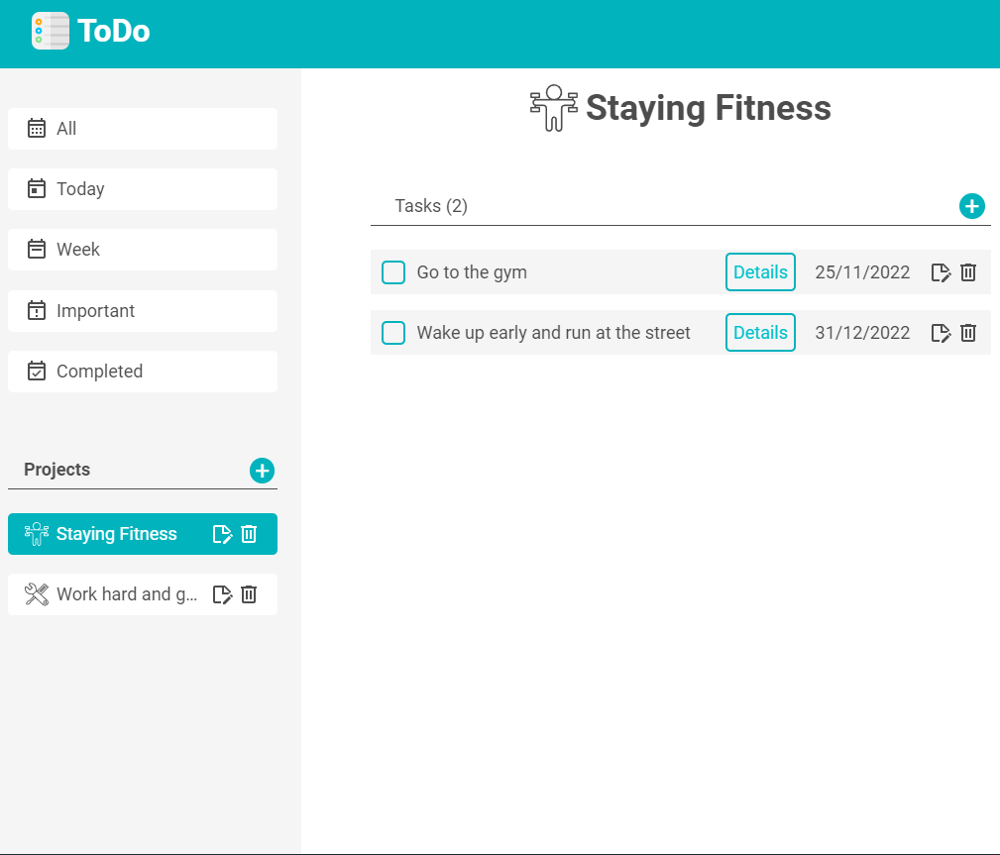

# todo-list
Project: Todo List

This is a ToDo website where you can create tasks linked to projects. The application allows users to manage their tasks efficiently with features like adding, editing, and deleting tasks, and categorizing them under different projects.

## Technologies Used
- JavaScript
- HTML
- CSS
- Webpack

## Features

- **Create Tasks**: Users can create new tasks with a title, description, due date, and priority level.

- **Edit and Delete Tasks**: Tasks can be edited or deleted as needed.

- **Task Completion**: Users can mark tasks as completed.

- **Due Date Filtering**: View tasks that are due today, this week, or filter by other criteria.

- **Priority Levels**: Assign priority levels to tasks to highlight important tasks.

- **Responsive Design**: The interface is designed to be responsive, ensuring an optimal experience across various screen sizes.

[Live Demo](https://renatoguedes-dev.github.io/todo-list/)
